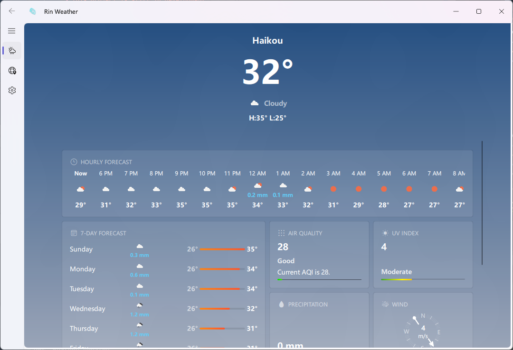
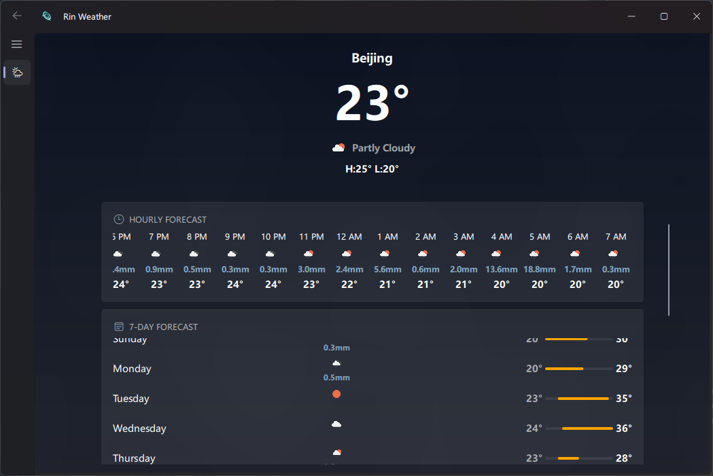
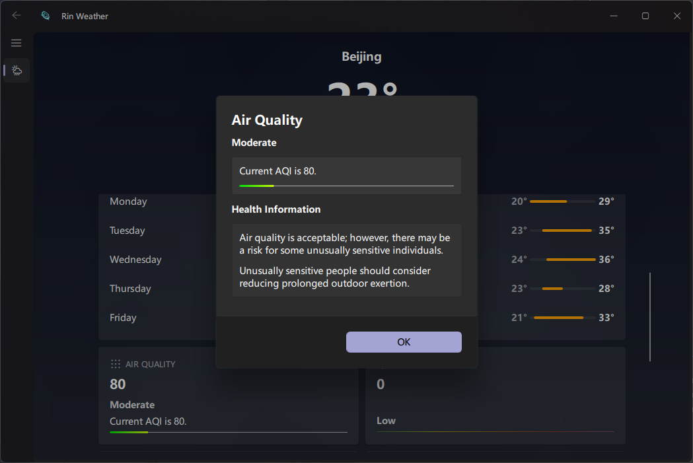
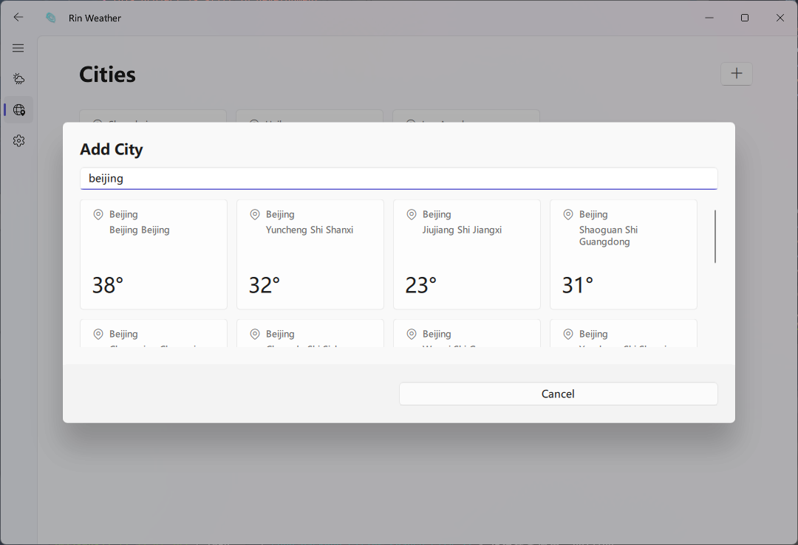
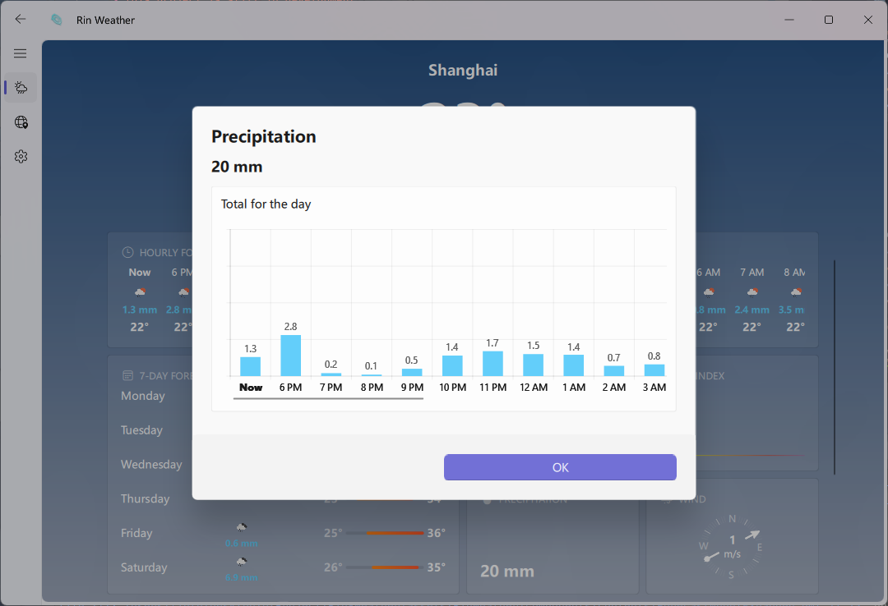

# Rin-Weather
A QML weather app in PySide6 with RinUI

> [!TIP]
> This project is still in development. (could somebody help me with the logo lol)

## Introduction

**RinWeather** is a weather application built with [RinUI](https://github.com/RinLit-233-shiroko/Rin-UI), developed
using PySide6 and QML.  
It features a smooth, modern interface, multi-city management, local data caching, and dynamic theme support.

## Features
- **Powered by RinUI**: Beautiful, modern UI inspired by Fluent Design with full component customization
- **Multi-city support**: Easily manage and view multiple locations
- **Rich weather information**: Displays current conditions, forecasts, and even more detailed information
- **Auto theme switching**: Syncs with system light/dark mode

## Screenshots

